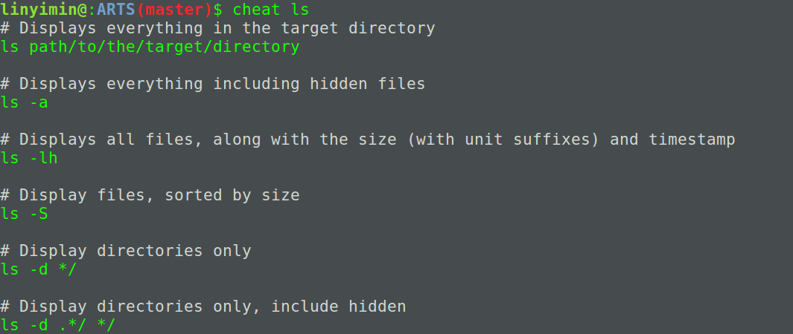

> Time: 2019.05.20 - 2019.05.26
>
> Algorithm: Climbing Stairs
>  
> Review: File Types
>
> Tip: `man`命令的使用
> 
> Share: 不可中断进程和僵尸进程


## Algorithm

### Climbing Stairs

You are climbing a stair case. It takes n steps to reach to the top.

Each time you can either climb 1 or 2 steps. In how many distinct ways can you climb to the top?

**Note**: Given n will be a positive integer.

**Example 1:**

```
Input: 2
Output: 2
Explanation: There are two ways to climb to the top.
1. 1 step + 1 step
2. 2 steps
```

**Example 2:**

```
Input: 3
Output: 3
Explanation: There are three ways to climb to the top.
1. 1 step + 1 step + 1 step
2. 1 step + 2 steps
3. 2 steps + 1 step
```

### 解法

很明显,很容易能想到使用递归实现.

递归公式: f(n) = f(n-1) + f(n-2)
退出条件: 

```
1. n = 1 => return 1;
2. n = 2 => return 2;
```

由于会存在很多重复的计算,所以使用一个`memo`数组存储已经计算过的结果.

### 代码实现
```C
int climb_stairs(int n, int memo[]) {
    if (n <= 0) {
        return 0;
    }
    
    if (n == 1) {
        return 1;
    }
    if (n == 2) {
        return 2;
    }
    if (memo[n] > 0) {
        return memo[n];
    }
    memo[n] = climb_stairs(n - 1, memo) + climb_stairs(n-2, memo);
    return memo[n];
}


int climbStairs(int n){
    int memo[n+1];
    for (int i = 0; i <= n; i++) {
        memo[i] = 0;
    }
    return climb_stairs(n, memo);
}
```

## Review

### File Types

1. 普通文件
2. 文件夹
3. 块设备文件
   
提供缓存,可以随机访问固定大小的设备.

4. 字符设备文件

不提供缓存的设备文件.

5. FIFO文件

用于不同进程间的通信,有时也叫管道.

6. socket文件

用于进程间的网络通信.

7. 符号链接文件

指向其他文件的文件.

补充: 字符设备与块设备

1. 字符设备

提供连续的数据流,应用程序应该按照顺序读取,不支持随机存取,支持按字节/字符读取数据.例如键盘和串口等.

2. 块设备

应用程序可以随机访问设备数据，程序可自行确定读取数据的位置。硬盘、软盘、CD-ROM驱动器和闪存都是典型的块设备，应用程序可以寻址磁盘上的任何位置，并由此读取数据。此外，数据的读写只能以块(通常是512B)的倍数进行。与字符设备不同，块设备并不支持基于字符的寻址。

### 参考链接

[字符设备、块设备与网络设备](https://www.jianshu.com/p/477c5b583fbe)

## Tip

### `man`命令的使用

Linux下学会使用`man`命令十分重要.

1. `man`命令提供了9中类型的帮助文档, 可以通过命令`man man`查看

```
1   Executable programs or shell commands(可执行程序或shell命令帮助)
2   System calls (functions provided by the kernel)(系统调用帮助)
3   Library calls (functions within program libraries)(库函数调用帮助)
4   Special files (usually found in /dev)(特殊文件帮助)
5   File formats and conventions eg /etc/passwd(文件格式帮助, 文件中各个字段的含义)
6   Games
7   Miscellaneous (including macro packages and conventions), e.g. man(7), groff(7)(其他)
8   System administration commands (usually only for root)(系统管理命令帮助)
9   Kernel routines [Non standard]
```

有时候可能会存在同名的命令, 系统调用等, 可以使用`man 2 command`进行区分

2. 在命令行描述中,通过关键词查找相关命令

如下想查找创建文件夹的命令:

```shell
$ man -k directory | grep create
```


可以发现`mkdir`就是我们需要查找的命令.

3. 使用`cheat`命令查看相关命令常用例子

**安装**

```shell
sudo apt-get install python-pip git
sudo pip install docopt pygments
git clone https://github.com/chrisallenlane/cheat.git
cd cheat
sudo python setup.py install
```

例子: 查看命令`ls`的常用例子

```shell
$ cheat ls
```



## Share

### 不可中断进程和僵尸进程

#### 进程状态

- R(Running or Runable): 进程在就绪队列中,正在运行或者正在等待CPU资源运行
- D(Disk Sleep): 不可中断状态睡眠(Uninterruptible Sleep),表示进程正在和硬件交互,且交互过程不允许被其他进程或者中断打断
- Z(ZOmbie): 僵尸进程,进程实际上已经结束, 但是父进程没有回收它的资源(如进程描述符, PID等)
- S(Interruptible Sleep): 可中断睡眠状态,表示进程因为某个事件而被系统挂起.
- I(Idle): 空闲状态
- T(Stooped, Traced): 暂停或者跟踪状态


#### 僵尸进程

正常情况下,当一个进程创建了子进程之后, 应该通过系统调用`wait`或者`waitpid`等待子进程结束然后回收子进程的资源.子进程在结束后,会产生`SIGCHLD`信号,所以父进程也可以通过向内核注册SIGCHLD`信号的处理函数,异步回收资源.一般来说,僵尸进程持续的时间都比较短,在父进程回收了它的资源后就会消亡,或者在父进程退出后,有`init`进程回收后也会消亡.

而一旦父进程没有处理子进程的终止,还一直保持运行状态,那么子进程会一直处于`僵尸状态`.<font color="#dd0000">大量的僵尸进程会耗尽PID进程号,导致不能创建新的进程.</font>

#### 其他相关概念

##### 进程组

表示一组相互关联的进程,例如每个子进程都会父进程所在组的成员.在后台运行的命令会构成`后台进程组`, 在前台运行的命令构成`前台进程组`.

##### 会话

共享同一个控制终端的一个或多个进程组.当我们通过`ssh`登录服务器,就会打开一个控制终端`tty`,这个控制终端就会对应一个会话.

#### 案例分析

启动相关docker容器

```shell
$ docker run --privileged --name=app -itd feisky/app:iowait
```

然后使用`ps -aux`查看相关进程信息

```shell
$ ps -aux | grep /app
```


根据`ps`命令的结果,我们可以知道多个`app`进程已经成功启动

- `+`: 前台进程组
- `s`: 会话的领导进程

接着使用`top`查看系统的使用资源:

```shell
top
```


根据`top`命令的结果,我们可以发现存在三个问题:

1. 平均负载性对较高(4个逻辑CPU)
2. `iowait`太高(这也是引起平均负载升高的一大原因)
3. 僵尸进城在不断增多,说明父进程没有正确清理子进程的相关资源

##### iowait分析

很明显,iowait升高,首要应该去查询系统的IO情况.

我们使用`dstat`查看系统的IO情况

```shell
$ sudo dstat 1 5 # 间隔1秒输出5组数据
```


可以发现磁盘的读请求很大,说明`iowait`的升高与读请求相关,也就是磁盘读导致的.

接着可以使用`pidstat`命令查看所有进程的IO情况

```shell
$ pidstat -d 1 20 # 间隔1秒输出20组数据
```


可以发现大量的`app`进程在进行磁盘读操作,每秒读速率为4MB.这里还可以验证一点:<font color="#dd0000">由于进行磁盘IO的进程会处于`不可中断状态(D)`, 内核对硬件的一种保护机制, 避免出现数据的不一致.</font>

根据上述`pidstat`命令得到的结果,使用`app`进程对应的`PID`, 在`ps`命令中查找, 会发现其对应的状态是`D`, 也就是处于`不可中断状态`.


现在基本上可以确定是进程`app`的问题,那`app`进程到底在进行什么IO操作呢?由于进程想要访问磁盘,必须要使用`系统调用`陷入内核态, 在内核态完成IO操作.所以接下来我们要找出进程的`系统调用`.我们使用`strace`命令来查找相关的系统调用.`strace`是最常用的跟踪系统调用的命令工具.

在终端运行`strace -p PID`:

```shell
$ strace -p 7433
```


可以发现`starce`命令执行失败了, 而且错误居然是没有权限,而我们一直用的是`root`账户.这种情况下,我们<font color="#dd0000">一般需要检查一下进程的状态是否正常</font>

```shell
$ ps -aux | grep 7433
```


可以发现, PID为7433的进程已经变为`僵尸进程`,而僵尸进程是已经执行完退出的进程,所以无法使用`strace`命令进行跟踪分析.根据以上的分析我们可以发现传统的`ps`, `dstat`, `pidstat`, `strace`, `top`这些工具已经不能再提供更多的消息了.所以需要借助基于事件记录的动态追踪工具`perf`了.

首先执行`perf record -g`, 然后执行`perf report`


可以发现`app`的确在通过系统调用`sys_read()`读取数据, 并且从`new_sync_read`和`blkdev_direct_io`可以看出,进程正在对磁盘进行**直接读**,也就是绕过了系统缓存,每个读请求都会从磁盘直接读,导致iowait升高.

查看应用的源码`app.c`,可以发现使用了`O_DIRECT`选项直接打开了磁盘.

<font color="#dd0000">直接读写磁盘, 对IO敏感型应用(数据库系统)很友好,因为可以在应用中直接控制磁盘的读写.但是在大部分的情况下,最好还是通过系统缓存来优化磁盘IO</font>

##### 僵尸进程

僵尸进程是因为父进程没有回收子进程资源而出现的,所以解决方法很直接:<font color="#dd0000">找出子进程的父进程,然后在父进程中解决.</font>

使用`pstree -p PID`查找子进程PID对应的父进程,然后在父进程中使用`wait`或`waitpid`或者注册`SIGCHLD`信号处理函数进行子进程资源的回收即可.
